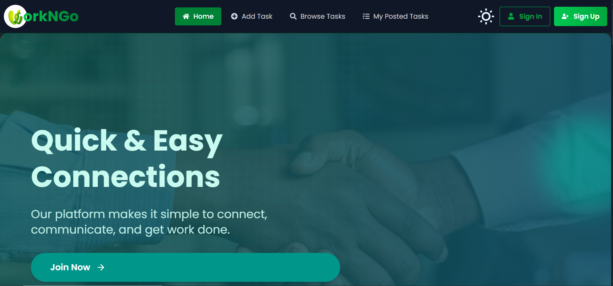

# WorkNGo

A dynamic freelance task marketplace platform that connects clients with freelancers for small-scale jobs. Whether you're looking to get a task done or searching for freelance work, **WorkNGo** provides a simple and efficient way to post, bid, and collaborate.

🌐 **Live Site:** [https://assaignment-10-client-162f6.web.app/](https://assaignment-10-client-162f6.web.app/)

## 🚀 Features

- 🔐 **Authentication System**: Secure sign-up and login with email, Google, and GitHub options using Firebase Authentication.
- 📋 **Task Posting & Bidding**: Clients can post tasks with descriptions, budgets, and deadlines. Freelancers can place bids with ease.
- 📄 **Individual Task Pages**: Each task includes detailed information, including bid counts, deadlines, and user interaction.
- 🎨 **Modern UI/UX**: Built with Tailwind CSS, DaisyUI, and Framer Motion for responsive, smooth, and visually appealing design.
- 🌙 **Dark Mode Toggle**: Seamless light/dark theme switching using `react-dark-mode-toggle`.

## 🧩 Tech Stack

- **Frontend:** React, Vite, Tailwind CSS, DaisyUI
- **Authentication & Hosting:** Firebase
- **UI Enhancements:** Framer Motion, SweetAlert2, React Icons, Lucide React
- **Routing:** React Router
- **Utilities:** React Hot Toast for notifications, Swiper and React Slick for sliders/carousels

## 📸 Screenshots

